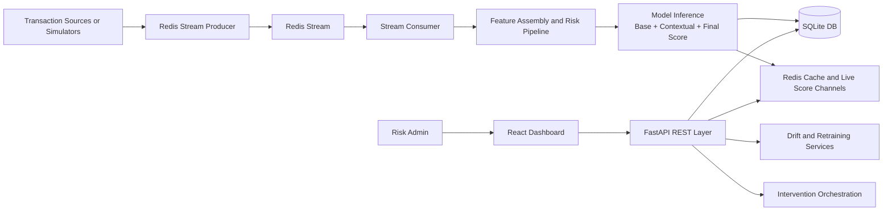

# PIE: Pre-Delinquency Intelligence Engine

A real-time, ML-driven risk intelligence platform that predicts customer delinquency risk from live transaction behavior, monitors model drift, and triggers intervention workflows for risk teams.


## Table of Contents
- Project Description
- Key Features
- Tech Stack
- System Architecture
- Project Flow
- Business Impact
- System Feasibility and Scalability
- Market Analysis
- Setup and Run Guide
- Repository Structure
- Contributors
- Conclusion

## Project Description
PIE (Pre-Delinquency Intelligence Engine) is built to shift lending and collections workflows from reactive to proactive.

Instead of waiting for missed payments, PIE:
- Ingests transaction behavior continuously.
- Scores risk in near real time using ML models.
- Detects drift and supports retraining workflows.
- Creates intervention queues for risk operations and governance.

The platform combines an API backend (FastAPI), streaming and cache infrastructure (Redis streams), and a modern analytics dashboard (React + Vite + TypeScript).

## Key Features
- Real-time risk scoring APIs for customer-level predictions.
- Hybrid model monitoring for baseline and contextual model behavior.
- Stream ingestion and consumer pipeline for continuous event processing.
- Drift detection and retraining orchestration hooks.
- Intervention queue with preview, approval, reject, and export flows.
- Role-based admin authentication using Google OAuth session flow.
- Interactive dashboard for risk operations and monitoring.
- India timezone-ready scheduling and timestamp display alignment.

## Tech Stack

### Backend
- Python 3.x
- FastAPI + Uvicorn
- SQLAlchemy
- APScheduler
- Scikit-learn, LightGBM, XGBoost, NumPy, Pandas, SciPy
- Redis (streaming, cache, lightweight pub/sub style state)
- OAuth integrations via HTTPX

### Frontend
- React 18
- Vite
- TypeScript
- Tailwind CSS
- React Query
- Axios
- Recharts

### Data and Infrastructure
- SQLite (default local DB: `pie.db`)
- Redis Streams and consumer group model
- Docker Compose file placeholder (ready for extension)

## System Architecture



### Component-level View
- Ingestion Layer: `backend/stream_producer.py`, `backend/simulator.py`
- Stream Processing Layer: `backend/stream_consumer.py`
- Prediction and Feature Logic: `backend/predict.py`, `backend/contextual_xgb.py`
- API and Route Layer: `backend/main.py`, `backend/routes/*`
- Monitoring and Retraining: `backend/monitoring.py`, `backend/retraining.py`, `backend/drift_retrain_pipeline.py`
- Intervention Engine: `backend/intervention_system.py`
- Frontend App: `pie-dashboard/src/*`

## Project Flow
1. Transaction events are produced through simulator or producer pipelines.
2. Events are appended to Redis stream and consumed by the stream consumer.
3. Features are derived from current transaction plus recent behavior context.
4. Risk inference executes model pipeline and assigns score plus bucket.
5. Prediction outputs are persisted and also cached for low-latency reads.
6. Monitoring endpoints track model health, drift, and retraining triggers.
7. Intervention orchestration translates high-risk signals into actionable queues.
8. Dashboard surfaces risk distribution, customer drill-downs, and operations views.

## Business Impact
- Earlier delinquency detection can reduce non-performing asset exposure.
- Automated intervention ranking improves collection team productivity.
- Continuous monitoring reduces blind spots from model degradation.
- Real-time scoring allows dynamic risk policy adaptation.
- Better explainability and governance improve audit readiness.

## System Feasibility and Scalability

### Feasibility
- Technical feasibility: Built on mature open-source stack with modular boundaries.
- Operational feasibility: API-first design supports easy integration with LOS/LMS systems.
- Economic feasibility: Can start with low-cost local/cloud deployment and scale incrementally.

### Scalability
- Horizontal scaling of API workers using ASGI process scaling.
- Redis stream model supports high-throughput event buffering and consumer groups.
- Stateless frontend and API components are container-friendly.
- Retraining and drift jobs are scheduler-driven and can be offloaded to separate workers.
- Architecture supports migration to managed DB and distributed caches for enterprise load.

## Market Analysis

### Problem Landscape
- Traditional risk systems are often batch-based and lagging.
- Delinquency prevention needs behavior-aware, event-driven scoring.
- Risk operations teams need both prediction and workflow tooling in one product.

### Target Segments
- NBFCs and digital lenders
- Mid-size banks modernizing risk ops
- Fintech credit and BNPL platforms
- Collection strategy and analytics teams

### Competitive Positioning
- Differentiator 1: Real-time event + risk + intervention in one stack.
- Differentiator 2: Drift-aware lifecycle instead of static model deployment.
- Differentiator 3: Fast experimentation via modular Python and React architecture.

### Adoption Opportunity
- Strong fit for organizations moving from rule-only to ML-assisted risk operations.
- Suitable for pilot deployment with controlled customer cohorts before full rollout.

## Setup and Run Guide

### 1) Clone and Environment
```bash
git clone <your-repo-url>
cd Course-Project
```

### 2) Backend Setup
```bash
python -m venv venv
# Windows PowerShell
.\venv\Scripts\Activate.ps1
pip install -r requirements.txt
```

Run backend:
```bash
uvicorn backend.main:app --reload --host 0.0.0.0 --port 8000
```

### 3) Frontend Setup
```bash
cd pie-dashboard
npm install
npm run dev
```

### 4) Default Local URLs
- Backend API: `http://localhost:8000`
- Frontend App: `http://localhost:5173`

## Repository Structure
```text
backend/              FastAPI app, ML logic, streaming, monitoring, intervention engine
pie-dashboard/        React dashboard frontend
models/               Trained artifacts and model files
src/                  Additional API/cache/kafka modules
requirements.txt      Python dependencies
pie.db                Local SQLite database
```

## Contributors
- Apurv Saktepar
- Nisha Pragane
- Shantanu Kaute
- Sohaa Jamadar

## Conclusion
PIE provides a complete foundation for proactive credit risk management, combining streaming intelligence, ML scoring, monitoring, and intervention workflows in a single platform. With modular architecture, enterprise-friendly scaling paths, and operationally meaningful outputs, it is positioned as a practical system for real-world risk transformation.